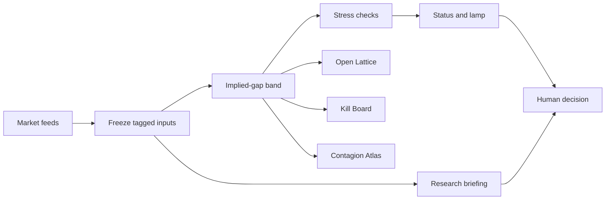

# Implied World

A research desk for overnight US equity rTokens (NVDA, TSLA, AAPL).

You freeze the weekend picture — cash last, wrapper last, BTC residual, hours to the next cash open — then see whether the live wrapper premium still has room into Monday. The desk does not place orders and does not tell you which side to take.

## What you get

- **Desk** — run a thesis, freeze tagged inputs, draw an implied-gap band, stress / twin / factor / size checks, optional research briefing from the frozen numbers only.
- **Open Lattice** — Monday cash-open × BTC residual grid (room left / no room / unstable).
- **Kill Board** — editable kill criteria with traffic lights against the last freeze.
- **Contagion Atlas** — shock one name and see whether stress stays local or hits all three.
- **Docs** — product guide, how to use, limits, roadmap, FAQ (`/docs`).

Every important number is tagged `observed`, `assumed`, or `source_failed`. Failed feeds stay labelled; they are never dressed up as live.

## System flow



Market feeds are frozen first. The band, checks, and briefing all use that same snapshot, so the numbers do not shift halfway through a review.

## Run locally

```bash
cp .env.example .env
# fill in your briefing key and base URL if you want research briefings
npm install
npm start
```

Open `http://127.0.0.1:3847` (or whatever `PORT` you set).

Useful endpoints:

- `GET /api/health`
- `POST /api/implied-world` — body like `{ "symbol": "NVDA", "thesis": "…", "style": "weekend_swing", "notionalUsdt": 5000 }`

Optional sanitize check:

```bash
npm run test:sanitize
```

## Environment

Copy `.env.example`. Real keys stay in `.env` (gitignored). Typical vars:

| Variable | Purpose |
|----------|---------|
| `BITGET_QWEN_API_KEY` | Briefing key (optional; desk numbers still work without it) |
| `QWEN_BASE_URL` | OpenAI-compatible chat base URL |
| `QWEN_MODEL` | Model used for the research briefing |
| `PORT` | HTTP port (default `3847`) |
| `QWEN_TIMEOUT_MS` | Briefing timeout |
| `SIGNAL_*_TIMEOUT_MS` | Feed timeouts |
| `SIGNAL_TRY_EVENTS` | Set `1` only if you want the slow earnings news path |

## Band math (fixed)

```
premium = (rtoken − cash) / cash
implied_gap_mid = premium + k × event_importance × residual_btc
implied_gap_lo  = mid − stress_pad
implied_gap_hi  = mid + stress_pad
```

Defaults: `k = 0.4`, `stress_pad = 0.8%` (then time-decayed by hours to cash open).

Status is about room, not side:

- `ROOM_LEFT` — premium still inside / below the band
- `NO_ROOM` — premium already at or above the top of the band
- `OPEN_BUT_UNSTABLE` — far below the band with a live event and a thin wrapper book

## Research briefing

The research briefing is drafted from the frozen table only. It does not invent prices or change the maths. If the key is missing or the call fails, you still get the full numeric desk (`briefing: null` plus a clear error note). Direction words (buy / sell / long / short) are stripped.

## Data quality

See `docs/data-quality.md` for how cash, wrapper, book, BTC, Nasdaq, and events are tagged when a feed succeeds, is skipped, or times out.

## Limits

1. No orders.
2. No buy / sell / long / short language in outputs.
3. Names in scope: NVDA, TSLA, AAPL.
4. The research briefing follows the freeze; freeze numbers are ground truth.
5. No secrets in git.

## License

Use at your own risk. Research output only — not trading advice.
